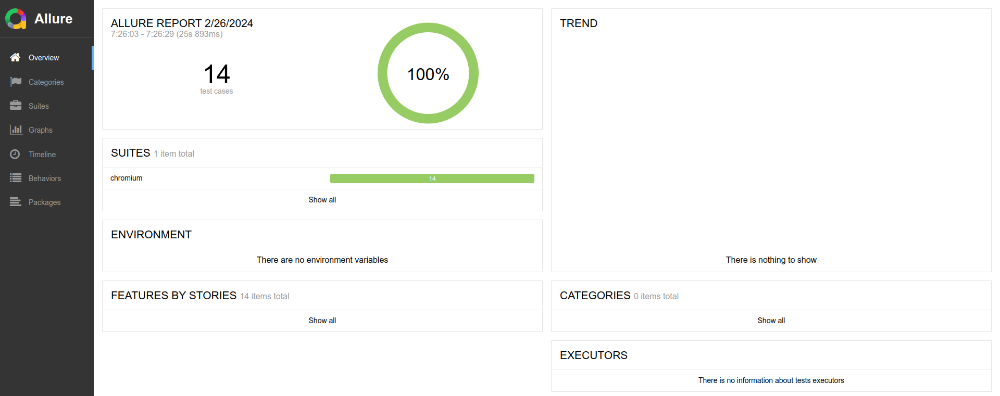
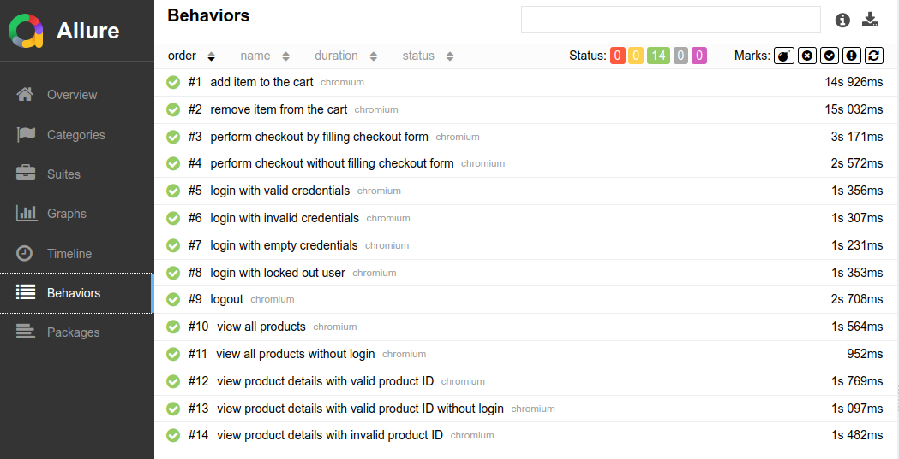
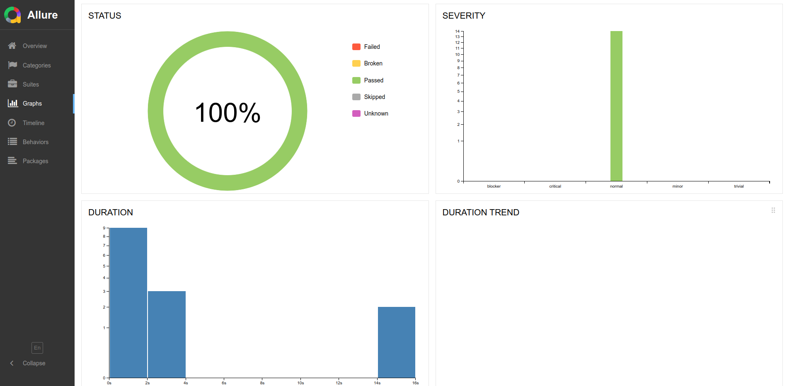

# playwright-saucedemo

Automation testing for Saucedemo web application using Playwright.

## Test Cases

This is the list of test cases for this project.

### Login

| **No** | **Description**                            |
| ------ | ------------------------------------------ |
| 1      | User can login with valid credentials      |
| 2      | User cannot login with invalid credentials |
| 3      | User cannot login with empty credentials   |
| 4      | User cannot login with locked account      |

### Logout

| **No** | **Description** |
| ------ | --------------- |
| 1      | User can logout |

### Products

| **No** | **Description**                                                      |
| ------ | -------------------------------------------------------------------- |
| 1      | User can view all products                                           |
| 2      | User cannot view all products without login                          |
| 3      | User can view product details with valid product ID                  |
| 4      | User cannot view product details with valid product ID without login |
| 5      | User cannot view product details with invalid product ID             |

### Cart

| **No** | **Description**                    |
| ------ | ---------------------------------- |
| 1      | User can add item to the cart      |
| 2      | User can remove item from the cart |

### Checkout

| **No** | **Description**                                            |
| ------ | ---------------------------------------------------------- |
| 1      | User can perform checkout by filling checkout form         |
| 2      | User cannot perform checkout without filling checkout form |

## How to Use

1. Clone this repository.

2. Install the dependencies.

```sh
npm install

npx playwright install
```

3. Run the test.

```sh
npm test
```

Use this command to run the test in headed mode. Headed mode means the browser activity is visible when testing.

```sh
npm run test_headed
```

## Test Result

The test result indicates all the key features are implemented correctly. This is the test report generated with [Allure](https://allurereport.org/).

Overall report.


List of tested features


Test Reports in Graph


## Notes

1. This web automation testing use chromium based browser (e.g. Google Chrome).
2. The web application that is used in this automation project is [Saucedemo Web Application](https://www.saucedemo.com/).
